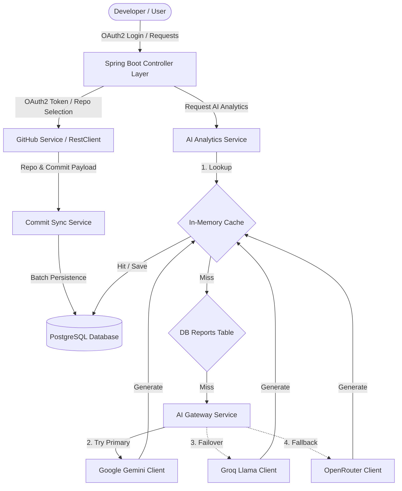

# 🚀 GitPilot

GitPilot is a developer analytics platform and AI assistant built with **Java 21** and **Spring Boot**. It securely authenticates users via GitHub OAuth2, synchronizes repository commit histories to a local PostgreSQL database, and employs a multi-provider AI Gateway with automatic failover to deliver deep engineering insights, health diagnostics, and recommendations.

---

## 🏗️ Architecture



---

## 🛠️ Environment Setup Guide

### Prerequisites
- **Java 21 JDK** or newer
- **PostgreSQL Database** running on port `5432`
- **GitHub Account** to register a Developer OAuth App

### 1. Register GitHub OAuth App
1. Go to your GitHub Profile -> **Settings** -> **Developer Settings** -> **OAuth Apps** -> **New OAuth App**.
2. Set configuration values:
   - **Application Name**: `GitPilot`
   - **Homepage URL**: `http://localhost:8080`
   - **Authorization callback URL**: `http://localhost:8080/login/oauth2/code/github`
3. Generate a **Client Secret** and copy both the **Client ID** and the **Client Secret**.

### 2. Configure Local Secrets (`.env`)
1. Copy the `.env.example` file to `.env`:
   ```bash
   cp .env.example .env
   ```
2. Fill in your environment properties in `.env` or set them as environment variables:
   ```properties
   GEMINI_API_KEY=your_actual_google_gemini_api_key
   GROQ_API_KEY=your_actual_groq_api_key
   OPENROUTER_API_KEY=your_actual_openrouter_api_key
   ```

### 3. Database Configuration
Ensure a PostgreSQL database named `gitpilot` is running. Update credentials in `src/main/resources/application.properties` if needed:
```properties
spring.datasource.url=jdbc:postgresql://localhost:5432/gitpilot
spring.datasource.username=postgres
spring.datasource.password=your_database_password
```

---

## 🚀 Running the Application Locally

Start the application using Maven Wrapper:
```bash
# Windows
.\mvnw.cmd spring-boot:run

# Linux / macOS
./mvnw spring-boot:run
```

---

## 📝 API Documentation Guide

Once the application is running, the interactive Swagger UI and OpenAPI documentation can be accessed at:
- **Swagger UI**: [http://localhost:8080/swagger-ui/index.html](http://localhost:8080/swagger-ui/index.html)
- **OpenAPI Description**: [http://localhost:8080/v3/api-docs](http://localhost:8080/v3/api-docs)

### Primary Endpoint Routes

| HTTP Method | Route | Description |
| :--- | :--- | :--- |
| **GET** | `/me` | Returns current authenticated GitHub user details. |
| **GET** | `/github/repositories` | Fetches user repositories directly from GitHub. |
| **POST** | `/repositories/select` | Saves selection preferences in PostgreSQL. |
| **POST** | `/repositories/{id}/sync` | Manually triggers commit synchronization for a repository. |
| **GET** | `/dashboard/repositories` | Exposes selected repository metrics, sync status, and AI insights. |
| **GET** | `/ai/repositories/{id}/health` | Retrieves AI-generated health score, strengths, and weaknesses. |
| **GET** | `/ai/repositories/{id}/summary` | Retrieves weekly engineering analysis summary. |
| **GET** | `/ai/repositories/{id}/recommendations` | Retrieves actionable code improvements. |

---

## ☁️ Deployment Instructions

### Production Profiles & Configurations
To deploy in production, run with the `prod` profile configuration:
```bash
java -jar target/gitpilot-0.0.1-SNAPSHOT.jar --spring.profiles.active=prod
```

### Docker Deployment
1. Build the production executable:
   ```bash
   ./mvnw clean package -DskipTests
   ```
2. Define a `Dockerfile` at the root:
   ```dockerfile
   FROM eclipse-temurin:21-jre-alpine
   VOLUME /tmp
   COPY target/gitpilot-0.0.1-SNAPSHOT.jar app.jar
   ENTRYPOINT ["java","-jar","/app.jar"]
   ```
3. Run the container, linking your environment keys:
   ```bash
   docker build -t gitpilot:latest .
   docker run -d -p 8080:8080 \
     -e GEMINI_API_KEY="key" \
     -e GROQ_API_KEY="key" \
     -e OPENROUTER_API_KEY="key" \
     gitpilot:latest
   ```
