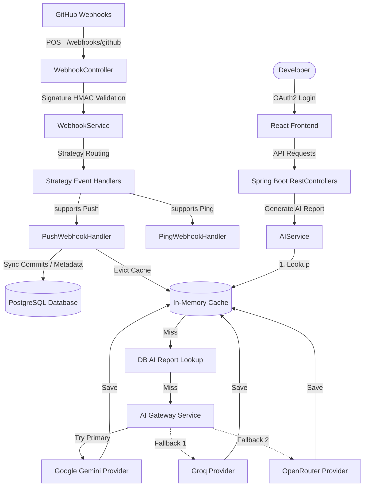

# 🚀 GitPilot — Developer Analytics & AI Gateway Monorepo

GitPilot is a developer analytics platform and AI assistant built with **Spring Boot (Java 21)** and **React (Vite)**. It authenticates users via GitHub OAuth2, tracks repository commit histories using real-time GitHub Webhooks, and employs a multi-provider AI Gateway with automatic failover to deliver deep engineering insights, health diagnostics, and recommendations.

---

## 📂 Repository Structure

The project is structured as a full-stack monorepo:
*   **`/backend`**: The Spring Boot Java application handling database persistence (PostgreSQL), security configs, OAuth flows, background syncs, and AI APIs.
*   **`/frontend`**: React + Vite application implementing a premium dark theme dashboard (inspired by GitHub, Linear, and Vercel).
*   **`/docs`**: System architecture diagrams and configurations.

---

## 🏗️ Architecture Overview

The system architecture features a **Strategy Pattern** for Webhook handling and a **Failover Chain** for AI insights:


```mermaid
graph TD
    User([Developer]) -->|OAuth2 Login| SPA[React Frontend]
    SPA -->|API Requests| BackendController[Spring Boot RestControllers]
    
    %% Webhooks
    Github[GitHub Webhooks] -->|POST /webhooks/github| WebhookController[WebhookController]
    WebhookController -->|Signature HMAC Validation| WebhookService[WebhookService]
    WebhookService -->|Strategy Routing| Handlers[Strategy Event Handlers]
    Handlers -->|supports Push| PushHandler[PushWebhookHandler]
    Handlers -->|supports Ping| PingHandler[PingWebhookHandler]
    
    PushHandler -->|Sync Commits / Metadata| DB[(PostgreSQL Database)]
    PushHandler -->|Evict Cache| Cache[(In-Memory Cache)]

    %% AI Gateway
    BackendController -->|Generate AI Report| AIService[AIService]
    AIService -->|1. Lookup| Cache
    Cache -->|Miss| DBReport[DB AI Report Lookup]
    DBReport -->|Miss| AIGateway[AI Gateway Service]
    
    AIGateway -->|Try Primary| Gemini[Google Gemini Provider]
    AIGateway -.->|Fallback 1| Groq[Groq Provider]
    AIGateway -.->|Fallback 2| OpenRouter[OpenRouter Provider]
    
    Gemini -->|Save| Cache
    Groq -->|Save| Cache
    OpenRouter -->|Save| Cache
```

Detailed architecture diagrams are located in [`/docs/architecture_diagram.mermaid`](file:///c:/Users/VENKATESH/Downloads/gitpilot/docs/architecture_diagram.mermaid).

---

## 🛠️ Environment Configuration

Secrets and local settings are managed via environment variables. Create a `.env` file at the root or within subfolders based on these templates:

*   Root template: [`.env.example`](file:///c:/Users/VENKATESH/Downloads/gitpilot/.env.example)
*   Backend template: [`backend/.env.example`](file:///c:/Users/VENKATESH/Downloads/gitpilot/backend/.env.example)
*   Frontend template: [`frontend/.env.example`](file:///c:/Users/VENKATESH/Downloads/gitpilot/frontend/.env.example)

### Required Keys

| Env Variable | Description |
| :--- | :--- |
| `SPRING_DATASOURCE_URL` | PostgreSQL JDBC connection URL. |
| `SPRING_DATASOURCE_USERNAME` | PostgreSQL username. |
| `SPRING_DATASOURCE_PASSWORD` | PostgreSQL password. |
| `GITHUB_CLIENT_ID` | GitHub developer OAuth app client ID. |
| `GITHUB_CLIENT_SECRET` | GitHub developer OAuth app client secret. |
| `GITHUB_WEBHOOK_SECRET` | Secret hash shared with GitHub for payload validation. |
| `GEMINI_API_KEY` | Google Gemini API key. |
| `GROQ_API_KEY` | Groq Llama API key. |
| `OPENROUTER_API_KEY` | OpenRouter API key. |

---

## 🚀 Running the Application Locally

### 1. Spring Boot Backend
Configure a PostgreSQL database named `gitpilot` running on port 5432.
Navigate into the `backend/` directory, configure your `.env` settings, and run:
```bash
cd backend
# Windows
.\mvnw.cmd spring-boot:run

# Linux / macOS
./mvnw spring-boot:run
```
Swagger UI details can be reviewed at: `http://localhost:8080/swagger-ui/index.html`

### 2. React Frontend Dev Server
Navigate into the `frontend/` directory, install packages, and boot the server:
```bash
cd frontend
npm install --legacy-peer-deps
npm run dev
```
Open `http://localhost:5173`. Requests are automatically proxied to the backend at port 8080.

---

## ⚡ Real-Time GitHub Webhooks Setup

To trigger immediate analytics refreshes and commit collections:
1.  Navigate to your GitHub repository -> **Settings** -> **Webhooks** -> **Add webhook**.
2.  **Payload URL**: Set to `http://<your-domain>/webhooks/github` (use ngrok/localtunnel for local testing).
3.  **Content type**: `application/json`.
4.  **Secret**: Use the same string value mapped to `GITHUB_WEBHOOK_SECRET`.
5.  **Events**: Select "Just the push event".

The backend verifies signatures using SHA-256 HMAC and delegates payloads to strategies like `PushWebhookHandler` or `PingWebhookHandler`.

---

## 📦 Production Builds

To compile and pack the SPA directly into the Java executable JAR:
```bash
# 1. Build frontend
cd frontend
npm run build

# 2. Package Spring Boot app
cd ../backend
./mvnw clean package -DskipTests
```
The output jar will be located at `backend/target/gitpilot-0.0.1-SNAPSHOT.jar` and can be run with:
```bash
java -jar target/gitpilot-0.0.1-SNAPSHOT.jar
```

<!-- Test GitPilot commit synchronization: 2026-07-24 -->
<!-- E2E Workflow Verification Test: 2026-07-24 -->


